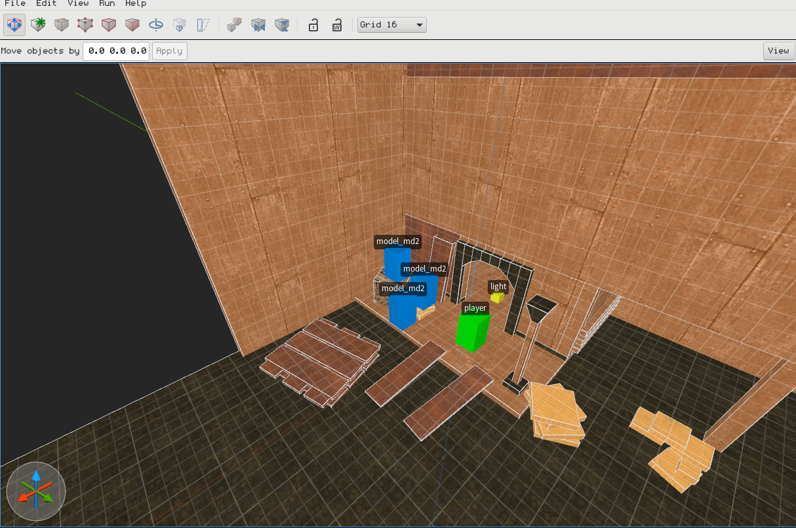

# Personal Idol [Work in progres]

This game engine is currently capable of rendering Trenchbroom (https://kristianduske.com/trenchbroom/) maps with models and lights and has around 60 FPS easily on my desktop and mobile devices (even low-end Android phones).

Simultaneously I am working on an isometric RPG game (non-free), but I am open sourcing the front-end part since it will be available via browser anyway. It can be used as a view/rendering layer in your projects.

It's not documented very well as I didn't have enough time to do so and I am the only maintainer. If anyone is interested to know/understand more, I'd be happy to help or at least start documenting the project. I am also looking for some help / maintainers.

## Screenshots

## Social

Discord: https://discord.gg/u65QyaJ

## Setup

Use `make start` to run the project. It works under Mac and Linux. It would be possible to run it under Windows, but I am not using Windows for software development (I have nothing against Windows, I just prefer Mac/Linux and I am not a Windows power user), so I didn't prepare Windows scripts (if you want to help and create a PR it would be appreciated).
