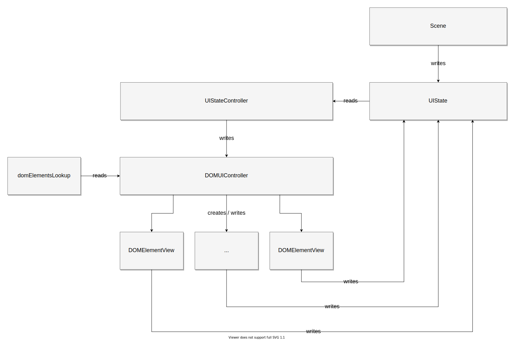

I really love web development, but I have to say it: DOM makes it really
difficult and unpredictable to work with. I think that nowadays nobody really
talks about it, because we are really used to how things are in web
development, but I think that this is a big elephant in the room.

Working with DOM feels like working with one huge side effect that makes it
really diffucult to keep any level of consistency. Anything can write, modify,
update, change any DOM node at any given moment (CSS, JS, browser plugins, OS,
etc). Fortunately
[Web Components](https://developer.mozilla.org/en-US/docs/Web/Web_Components)
try to deal with that to some degree, but there is still a long journey
ahead. Things get even more complicated when DOM needs to be modified in a
multi-threaded environment.

## Data flow

This data flow is designed to resolve at least some issues with working with
DOM and combining DOM with the general application state. It also allows
to render DOM elements in a multi-threaded environment.



From the bottom up:

1. [`DOMElementView`](dom-renderer-DOMElementView.mdx) is the lowest level
  object in the flow. It extends
  [`HTMLElement`](https://developer.mozilla.org/en-US/docs/Web/API/HTMLElement)
  and is used as a
  [web component](https://developer.mozilla.org/en-US/docs/Web/Web_Components).
  Those elements behave passively and need a controller for updates.

2. All views are registered in
  [`domElementsLookup`](dom-renderer-domElementsLookup.mdx), which is
  implemented as a basic hashmap. Each DOM view constructor is assigned to its
  unique tag name. This tag name is later used to render some desired element.

  ```typescript
  import { StatsReporterDOMElementView } from "./StatsReporterDOMElementView";

  import type { DOMElementsLookup } from "./DOMElementsLookup.type";

  export const domElementsLookup: DOMElementsLookup = {
    "pi-stats-reporter": StatsReporterDOMElementView,
  };
  ```

3. Any [`DOMElementView`](dom-renderer-DOMElementView.mdx) that is connected
  to the ui root element is picked up by the
  [`DOMUIController`](dom-renderer-DOMUIController.mdx) and managed.
  [`DOMUIController`](dom-renderer-DOMUIController.mdx) attaches the element
  to the render loop, so the `.update` method is called every animation frame
  and initializes the view with common properties (since custom element
  constructors can't take arguments, it's the only way).

  DOM Views can be created through
  [`DOMUIController`](dom-renderer-DOMUIController.mdx) (which listens to
  [`MessageChannel`](https://developer.mozilla.org/en-US/docs/Web/API/MessageChannel)
  messages) or by other views that put them into DOM.

  Each DOM view has its own unique id (in the form of UUID) and multiple
  instances of the same custom element class are distinguised by that id for
  the sake of updates.

4. [`DOMUIController`](dom-renderer-DOMUIController.mdx) is the imperative
  part of the data flow. It does not infer which components should be rendered
  from the UI state object. Instead, it responds to render messages
  ([`MessageDOMUIDispose`](dom-renderer-MessageDOMUIDispose.type.mdx)
  and [`MessageDOMUIRender`](dom-renderer-MessageDOMUIRender.type.mdx)). View
  id is defined in those messages, which allows to remotely render and update
  any specific component.

5. [`UIStateController`](personalidol-UIStateController.mdx) is the declarative
  part. It infers which elements should be rendered based on the `UIState`.
  `UIState` and `UIStateController` contain the business logic and need to be
  implemented in your project. This is an example `UIState`:

  ```typescript
  export type UIState = {
    currentMap: null | string;
    isInGameMenuOpened: boolean;
    isLanguageSettingsScreenOpened: boolean;
    isScenePaused: boolean;
    isUserSettingsScreenOpened: boolean;
  };
  ```

  It is the responsibility of the
  [`UIStateController`](personalidol-UIStateController.mdx) to determine if the
  current state is valid or a state transition is allowed. If it is, then
  it requests the [`DOMUIController`](dom-renderer-DOMUIController.mdx)
  to render or dispose some specific DOM elements to make the DOM state
  match the desired UI state.

6. `UIState` can be modified by other views (for example "after clicking this
  button, menu should be opened") or by the scene controller (for example
  "after mounting this scene, in-game HUD should be visible").

7. [`DOMUIController`](dom-renderer-DOMUIController.mdx) can receive direct
  messages from both DOM views and scene controllers, but this possibility
  is there to handle some possible edge-cases that may be difficult to handle
  via the `UIState`
  and [`UIStateController`](personalidol-UIStateController.mdx) - primarily
  when the scene controller or view need to set specific properties to the DOM
  view. This disrupts the unidirectional data flow (which may be fine in some
  cases) and as a rule, `UIState` should be used for the sake of consistency.

## See also

Yes, I know that this lecture is kind of old, but many points are still valid.
You can also view it as a context and a general history of how things came to be
as they are in the web development.

<iframe
  height="400"
  width="100%"
  src="https://www.youtube-nocookie.com/embed/Y2Y0U-2qJMs"
  frameBorder="0"
  allow="accelerometer;clipboard-write;encrypted-media;gyroscope;picture-in-picture"
  allowFullScreen
></iframe>

This is a really good lecture that focuses on how inconsistent DOM can be
(attributes vs properties) and thoughts on how many parts of DOM could be
skipped and how web could be better thanks to that.

<iframe
  height="400"
  width="100%"
  src="https://www.youtube-nocookie.com/embed/Zemce4Y1Y-A"
  frameBorder="0"
  allow="accelerometer;clipboard-write;encrypted-media;gyroscope;picture-in-picture"
  allowFullScreen
></iframe>
