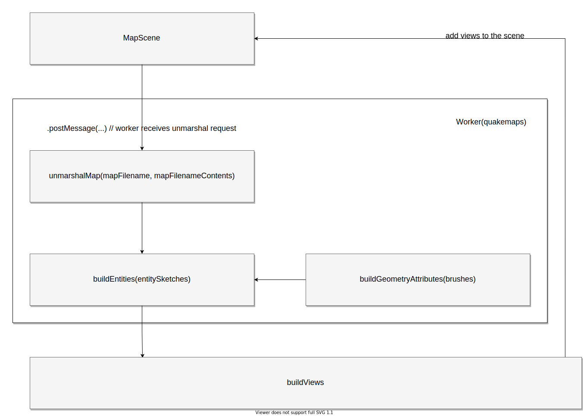

Quake BSP map format is an interesting one and contains not only geometry data
but also domain metadata that can be used in your game. They not only define
the map geometry and meshes, but also tell you how the player can interact with
map objects. This can be used to produce any kind of game or project, from
first person shooters (obviously) to role playing games, depending on how your
engine handles those properties.

Because of that, map parsing process is split in a few steps to make it
flexible and adaptable to a virtually any kind of project (not necessarily a
game).

## Data flow

The data flow itself is pretty straightforward and unidirectional.

1. First, you need to fetch map on your own to provide the map contents and
  filename (filename is just for debugging). You can load the map in whatever
  way you want (from network, file, etc). The only thing that matters
  is to have a map contents in a `string`.

2. [`unmarshalMap`](quakemaps-unmarshalMap.mdx) parses the map and creates
  entity sketches for further processing.
  [`EntitySketch`](quakemaps-EntitySketch.type.mdx) contains the entity
  properties that were provided in the map editor and an array of brushes (list
  of half-spaces that define the geometry).

  Why not just geoemtry attributes at this point? Because some of those
  entities are a part of the world entity and can be merged together, other
  entities can be a set of moving parts like doors or some rotation decorative
  element. This needs to be distinguished in your domain logic.

3. `buildEntities` is a function that you need to implement in your project.
  It processes entity sketches and decides which of them to merge as a static
  geometry or do anything else with them, like attaching some sort of
  controller or handle game logic in any other way.

  There is a default `buildEntities` funciton provided in the library, that
  just merges all the geometries together to produce one big mesh from
  the map. It is ok for just presentation, but using map in this way won't
  allow you to implement any game logic.

4. [`buildGeometryAttributes`](quakemaps-buildGeometryAttributes.mdx) is a
  helper function provided with the library. It is able to take an array of
  brushes as an argument and produce geometry attributes. It can be used to
  either merge geometries or just produce a geometry from a single entity.

## Data flow in Personal Idol

