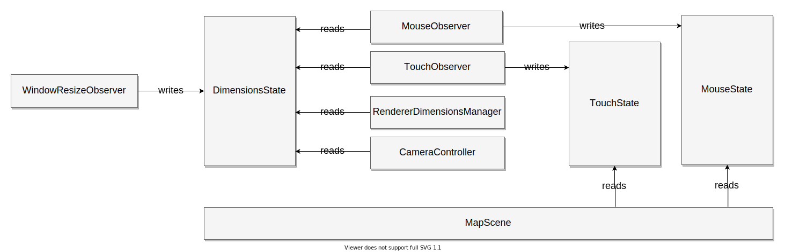

## Events, controllers and data

In short, event handlers are used only to collect the data and not to
immediately act on it. This is done to make separation of concerns easy. There
are a few general types of objects used:

1. Objects that listen to events and collect data (for example user input,
  window resize).
2. Controllers that organize actors in the desired way (for example, first
  resize the canvas, then move the camera based on user input, then render).
2. Objects that act on the data.

Data flow approach was inspired by the
[Flux architecture](https://facebook.github.io/flux/).

## Example

### Unidirectional data flow with the `DimensionsState`

This is the example partial flow of the
[`DimensionsState`](framework-DimensionsState.mdx), which keeps the canvas
dimensions. [`DimensionsState`](framework-DimensionsState.mdx),
[`MouseState`](input-MouseState.mdx),
[`TouchState`](input-TouchState.mdx) are not active (they do not notify
other elements about changes, they just keep the state). State objects always
have some kind of `lastUpdate` field for
reference, they are able to be polled for changes if necessary.

Flow of data is always unidirectional.
[`WindowResizeObserver`](framework-WindowResizeObserver.mdx) listens to the
window resize event and sets dimensions state to those of the window. This is
the only responsibility of this object and *nothing else* modifies the
[`DimensionsState`](framework-DimensionsState.mdx) array. This is not enforced
by defensing programming, using write tokens, etc, just by adhering to the
application architecture.

There are several objects that read from the
[`DimensionsState`](framework-DimensionsState.mdx). On the diagram only some of
them are listed for the sake of the example.

- [`MouseObserver`](input-MouseObserver.mdx) reads the dimensions array to
  produce normalized mouse pointer vector for further processing by the scene
  controller (the kind of [-1; 1] vector you can use for raycasting for
  example). Then it stores that vector alongside other mouse state parameters
  (on-screen position, currently pressed buttons, etc) to the
  [`MouseState`](input-MouseState.mdx).

- [`TouchObserver`](input-TouchObserver.mdx) does the same thing as
  [`MouseObserver`](input-MouseObserver.mdx), but with touch input. It
  writes to the [`TouchState`](input-TouchState.mdx).

- [`RendererDimensionsManager`](dom-renderer-RendererDimensionsManager.mdx)
  during every frame checks if the
  [`DimensionsState`](framework-DimensionsState.mdx) has been changed. If so, it
  reads the dimensions and sets the canvas size to those dimensions.

- [`CameraController`](personalidol-CameraController.mdx)
  during every frame checks if the
  [`DimensionsState`](framework-DimensionsState.mdx) has been changed. If so, it
  uses dimensions to set the camera aspect or frustum size (depending on the
  type of the camera)

- [`MapScene`](personalidol-MapScene.mdx) is a controller that reads from
  [`MouseState`](input-MouseState.mdx)
  and [`TouchState`](input-TouchState.mdx) to respond to user
  interactions.

### Separation of concerns benefits

As you can see, each object has a single responsibility that is not too broad
and the data flows in one direction from the single source of truth.
Using this approach, instead of directly responding to events, the application
achieves several things (among others):

1. The applicaiton does not have to register multiple event listeners. It is
  easy to maintain the single source of truth.
2. It does not have to respond unnecesarily quickly and often. Responding once
  during the animation frame is enough. It's not possible to push visible
  update to the user or redraw something faster anyway. For example, if
  `mousemove` event will be triggered 2-3 times during one frame, state will
  be updated three times, but all related computations will be done only once,
  just before render and paint. The same goes with resizing window, etc.
3. You can control when and how to handle events. For example, it would be
  better to resize the canvas and update the camera aspect first and render
  later to avoid drawing frame with invalid resolution and then updating its
  size in response to the `resize` event. If the app responds to events
  directly, anything can happen in whatever order.
4. Keeping the state in one place allows sharing information between workers
  and other different contexts where they are normally not accessible. For
  example, the framework uses
  [`SharedArrayBuffer`](https://developer.mozilla.org/en-US/docs/Web/JavaScript/Reference/Global_Objects/SharedArrayBuffer) (with fallback to polling and
  `.postMessage`) to keep the current state of mouse, keyboard, touch etc and
  shares this information with workers, which do not have access to the DOM
  (especially if the canvas is the
  [`OffscreenCanvas`](https://developer.mozilla.org/en-US/docs/Web/API/OffscreenCanvas)
  )

The huge thing that deserves it's own paragraph is maintainability. For
example, what if you want your application to fit the canvas into some
specific `HTMLElement` instead of span it across the entire window? You can
just replace the [`WindowResizeObserver`](framework-WindowResizeObserver.mdx)
with [`HTMLElementResizeObserver`](framework-HTMLElementResizeObserver.mdx) and
et voilà! Just works.
